# Part 1: 传统量化基础（Days 1-15）

> **学习目标**：建立量化投资的理论认知框架，理解为什么因子能够解释和预测收益。

---

## Day 1-3: 有效市场假说与行为金融学

### Day 1: 有效市场假说的三个层次

#### 什么是有效市场假说（EMH）

Eugene Fama在1970年提出的有效市场假说（Efficient Market Hypothesis）是量化投资的理论基石。它的核心观点是：**资产价格已经反映了所有可获得的信息**。

#### 市场有效性三层次

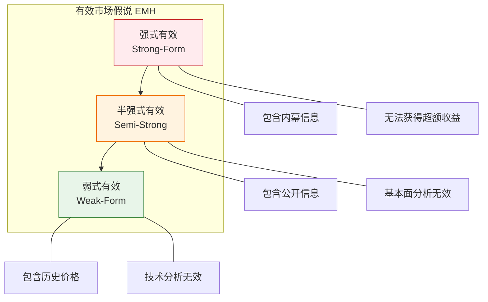

**信息集包含关系**：

```
强式有效信息集 ⊃ 半强式有效信息集 ⊃ 弱式有效信息集
├─ 内幕信息
├─ 公开信息（财报、宏观数据、新闻）
├─ 历史价格和成交量
└─ 其他私有信息
```

| 层次 | 信息范围 | 无效策略 | 实证证据 |
|------|----------|----------|----------|
| **弱式** | 历史价格 | 技术分析 | 短期动量、长期反转 |
| **半强式** | 公开信息 | 基本面分析 | PEAD、价值/动量因子 |
| **强式** | 所有信息 | 任何策略 | 内幕交易可获利 |

#### 价格对新信息的反应模式

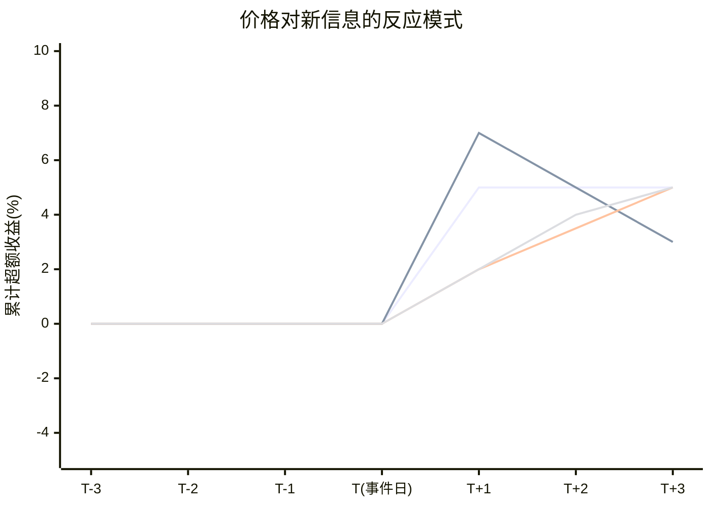

**解读**：
- **有效市场**：价格立即调整到新信息水平
- **反应不足**：信息逐步反映，产生动量效应
- **过度反应**：价格超调后反转
- **延迟反应**：信息扩散缓慢

---

### Day 2: 市场异象与因子投资的起源

#### 什么是市场异象（Anomalies）

市场异象是指**与市场有效性假说不一致的、系统性的收益模式**。它们是因子投资的起点。

#### 经典市场异象对比

```mermaid
quadrantChart
    title 市场异象：收益 vs 风险
    x-axis 低风险 --> 高风险
    y-axis 低收益 --> 高收益
    quadrant-1 高收益+高风险: 值得研究
    quadrant-2 高收益+低风险: 理想因子
    quadrant-3 低收益+低风险: 债券型
    quadrant-4 低收益+高风险: 价值陷阱

    "价值因子": [0.6, 0.55]
    "动量因子": [0.8, 0.75]
    "质量因子": [0.3, 0.5]
    "低波动因子": [0.2, 0.45]
    "规模因子": [0.7, 0.4]
    "市场指数": [0.5, 0.5]
```

#### 异象的生命周期


**各阶段特征**：

| 阶段 | 时间 | 特征 | 策略 |
|------|------|------|------|
| 发现期 | 0-2年 | 超额收益高，容量有限 | 积极建仓 |
| 成长期 | 2-5年 | 收益稳定，资金进入 | 适度配置 |
| 成熟期 | 5-10年 | 收益压缩，竞争激烈 | 降低权重 |
| 衰退期 | 10年+ | 几乎失效，或仅熊市有效 | 择机使用 |

---

### Day 3: 行为金融学——理解市场非理性的钥匙

#### 核心认知偏差图谱

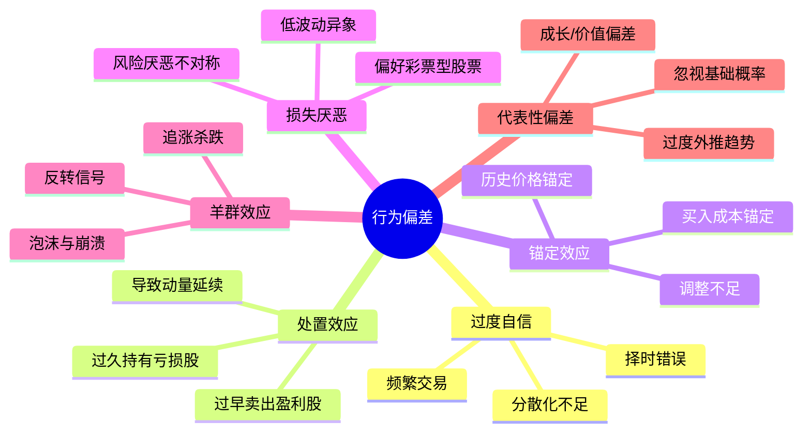

#### 有限套利机制

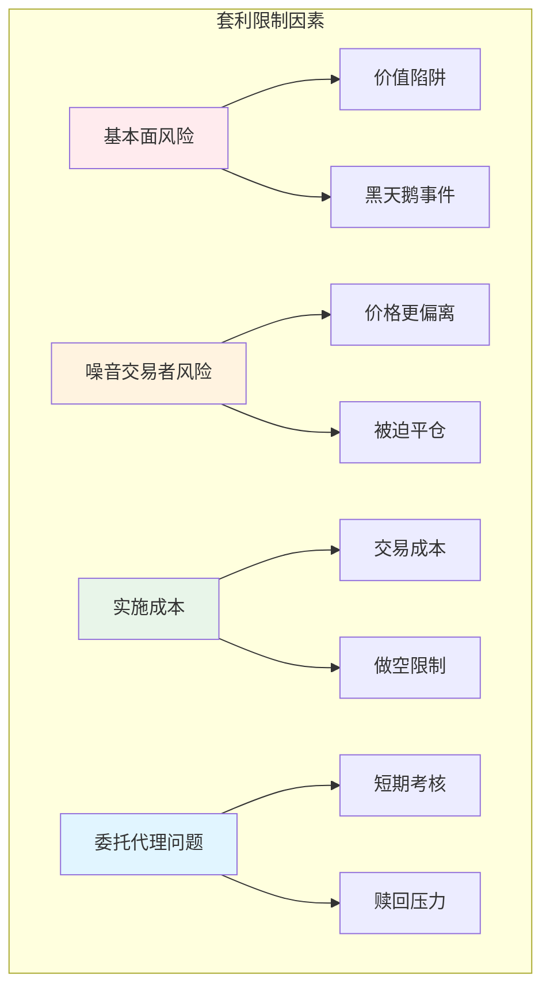

---

## Day 4-6: 风险与收益的关系

### Day 5: CAPM模型与Beta

#### CAPM模型结构

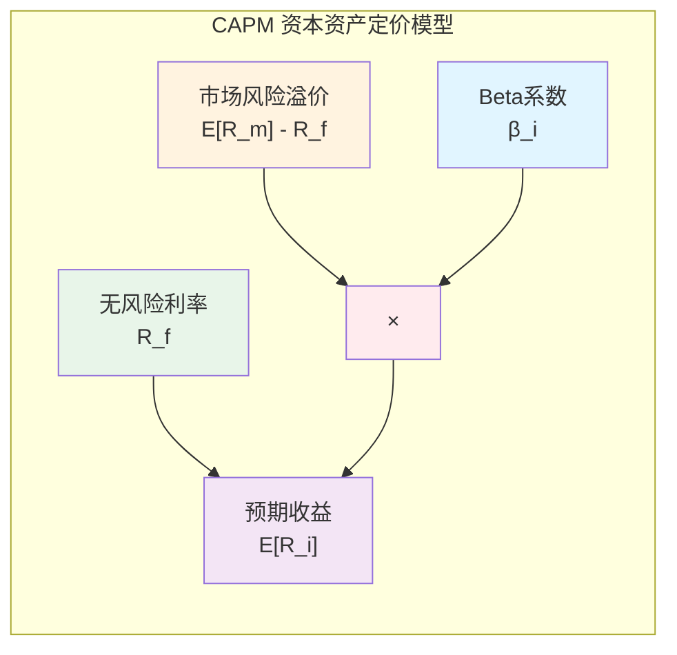

**公式**：`E[R_i] = R_f + β_i × (E[R_m] - R_f)`

#### Beta值的含义

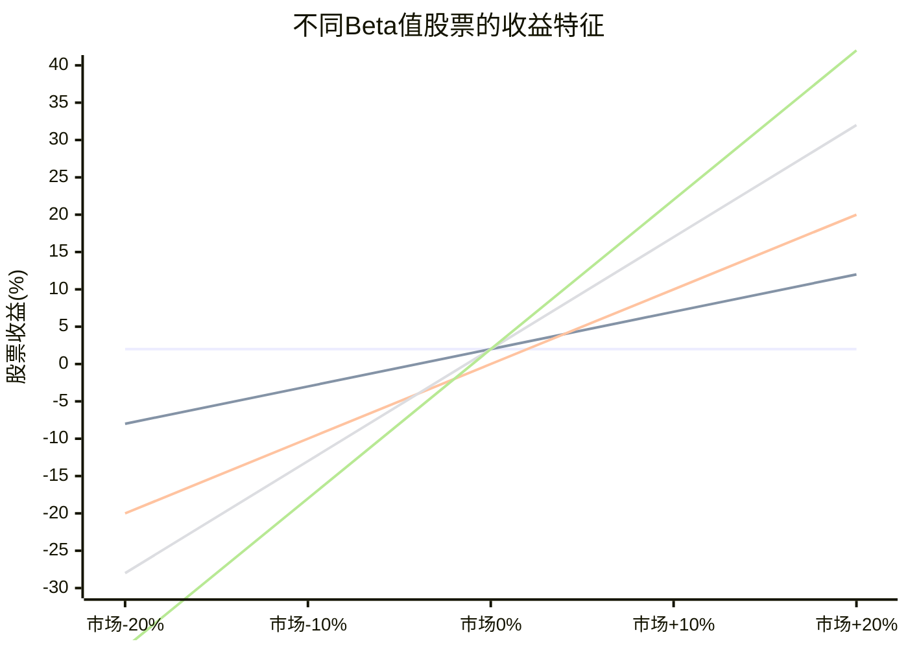

**Beta解释**：
- **β < 0.5**：防御型，波动小于市场
- **β = 1.0**：与市场同波动
- **β > 1.5**：进攻型，波动大于市场
- **β < 0**：与市场反向（极少见）

---

## Day 7-10: 套利定价理论（APT）

### APT多因子结构

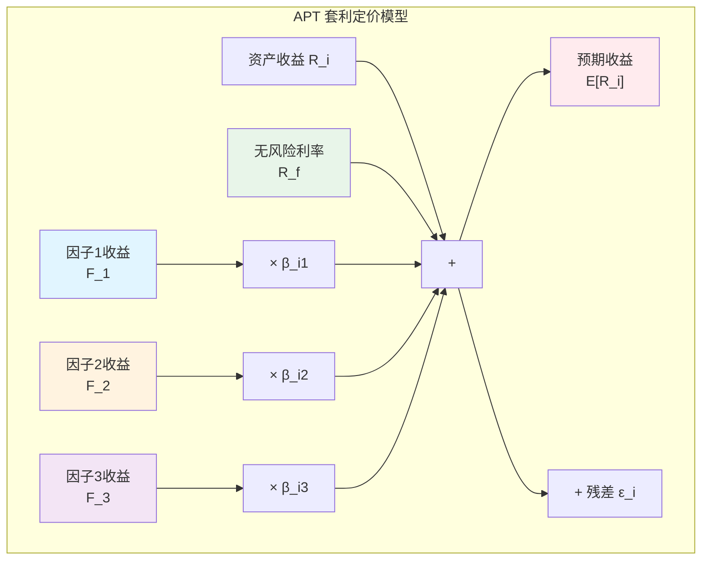

**对比**：

| 维度 | CAPM | APT |
|------|------|-----|
| 因子数量 | 1个（市场） | 多个（宏观/统计） |
| 理论基础 | 均值-方差优化 | 无套利条件 |
| 市场组合 | 必需 | 不需要 |
| 因子选择 | 固定 | 灵活 |

---

## Day 11-15: Fama-French框架

### Fama-French三因子模型

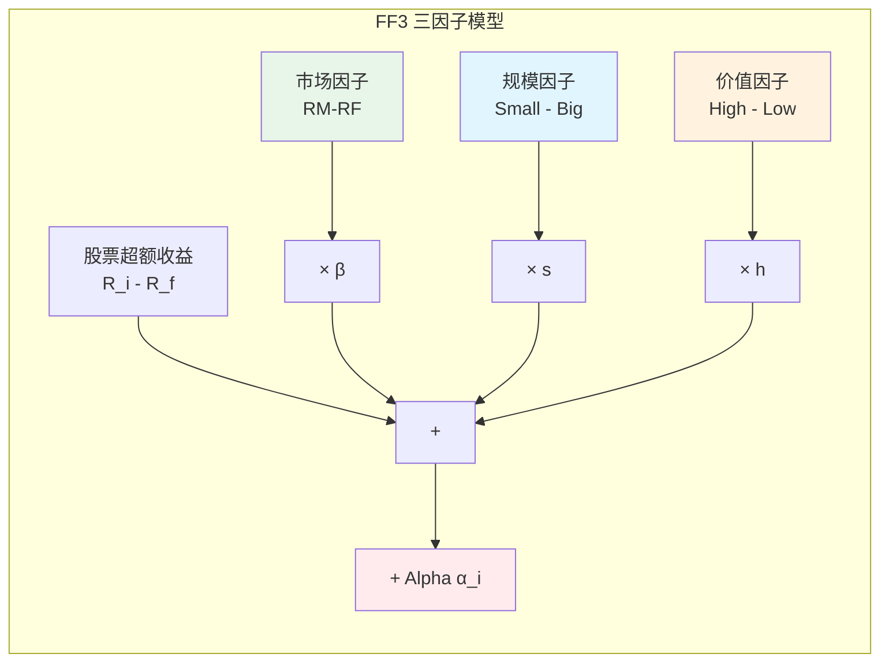

### 五因子模型扩展

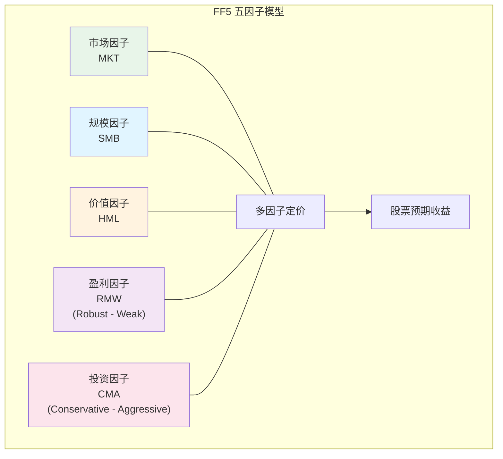

### 因子收益历史表现（1990-2020）

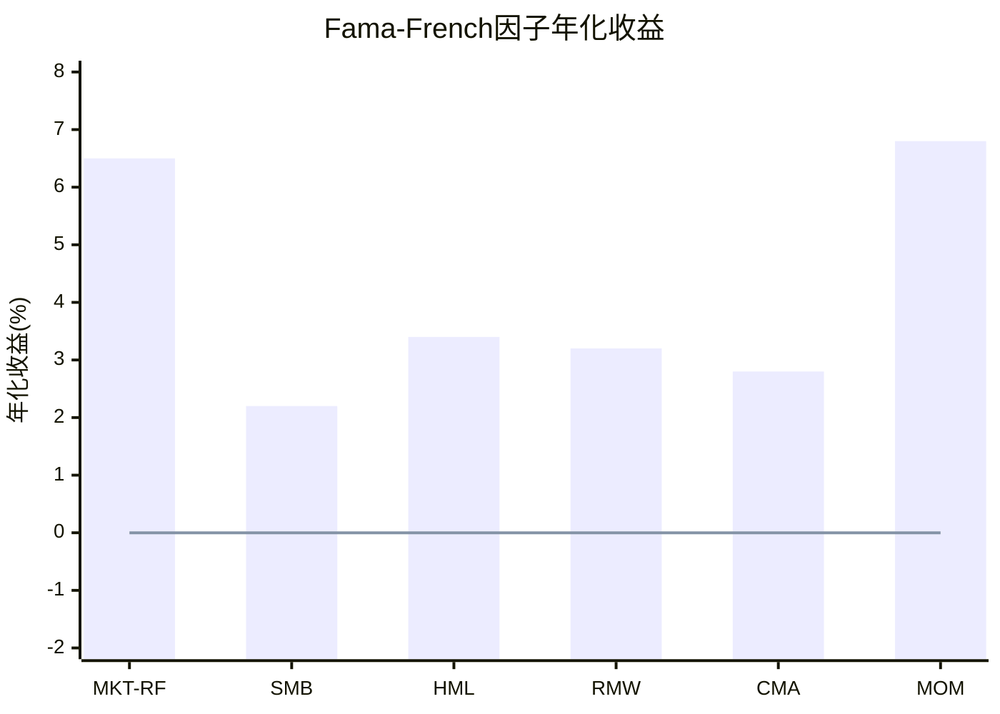

---

## Part 1 知识图谱

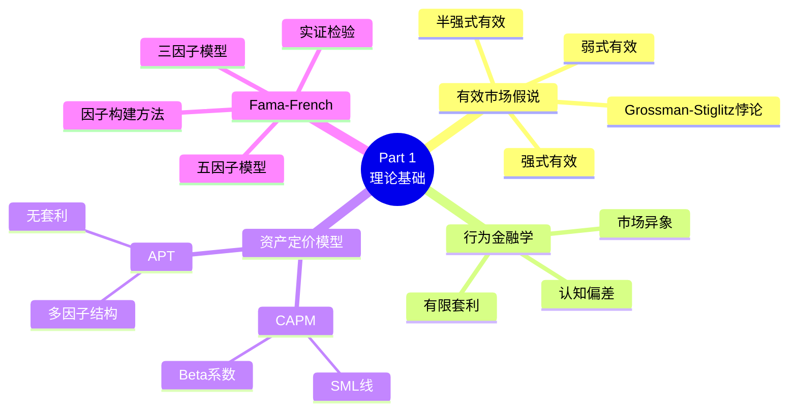

---

## Part 1 总结

通过这15天的学习，你应该建立了以下认知框架：

### 核心理论

1. **市场不是完全有效的**，存在可预测的因子收益
2. **收益来自承担风险和发现错误定价**
3. **多因子模型比单因子模型更能解释收益差异**
4. **因子收益可能是风险补偿，也可能是行为偏差的结果**

### 关键概念回顾

| 概念 | 核心要点 | 公式/关键值 |
|------|----------|-------------|
| **EMH** | 三层次：弱/半强/强 | 信息集逐步扩大 |
| **CAPM** | 单因子定价 | E[R] = R_f + β(R_m - R_f) |
| **APT** | 多因子无套利 | E[R] = R_f + Σβ_j × RP_j |
| **FF3** | 市场+规模+价值 | SMB, HML构建 |
| **FF5** | 加入盈利+投资 | RMW, CMA |

准备好进入Part 2，深入探索经典因子了吗？
