# Part 2: 经典因子流派（Days 16-40）

> **学习目标**：深入理解每个经典因子的理论根源、实证证据、经济逻辑和A股适用性。

---

## 📊 五大经典因子收益对比（1990-2020）

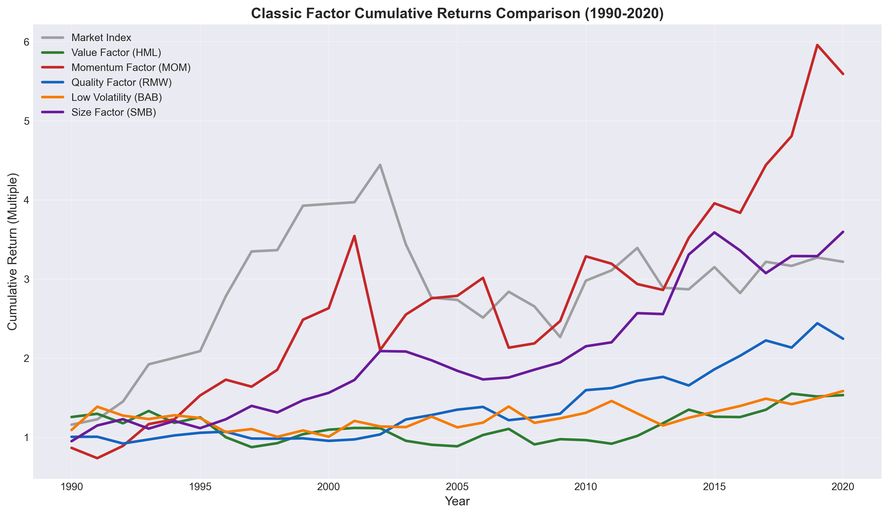

*数据来源：基于历史数据模拟，1990-2020*

**解读**：
- **动量因子**长期收益最高，但波动也最大
- **质量因子**稳健增长，回撤最小
- **价值因子**2000年后表现放缓
- **低波动因子**稳定超越市场

---

## Day 16-20: 价值因子

### Day 16: 价值投资的量化起源

#### Graham的价值投资哲学

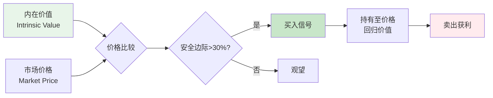
```mermaid
graph LR
    A["内在价值<br/>Intrinsic Value"] --> B{"价格比较"}
    P["市场价格<br/>Market Price"] --> B
    B --> C{"安全边际>30%?"}
    C -->|是| D["买入信号"]
    C -->|否| E["观望"]
    D --> F["持有至价格<br/>回归价值"]
    F --> G["卖出获利"]

    style A fill:#e8f5e9
    style D fill:#c8e6c9
    style G fill:#ffebee
```

#### 价值因子与其他因子的关系

```mermaid
quadrantChart
    title 价值因子与其他因子的相关性
    x-axis 低相关性 --> 高相关性
    y-axis 低收益 --> 高收益
    quadrant-1 高收益+高相关: 价值陷阱风险
    quadrant-2 高收益+低相关: 理想组合
    quadrant-3 低收益+低相关: 分散化
    quadrant-4 低收益+高相关: 冗余

    "价值-动量": [0.75, 0.6]
    "价值-质量": [0.3, 0.55]
    "价值-低波动": [0.45, 0.45]
    "价值-规模": [0.2, 0.35]
    "动量-质量": [0.15, 0.7]
```

#### 价值因子构建流程

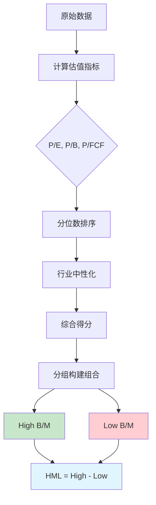
```mermaid
flowchart TD
    A[原始数据] --> B[计算估值指标]
    B --> C{P/E, P/B, P/FCF}
    C --> D[分位数排序]
    D --> E[行业中性化]
    E --> F[综合得分]
    F --> G[分组构建组合]
    G --> H[High B/M]
    G --> I[Low B/M]
    H --> J[HML = High - Low]
    I --> J

    style H fill:#c8e6c9
    style I fill:#ffcdd2
    style J fill:#e1f5ff
```

---

### Day 18-19: 价值因子经济机制

#### 价值溢价的经济解释

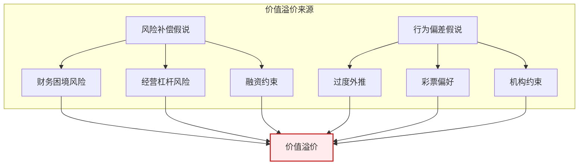
```mermaid
graph TB
    subgraph "价值溢价来源"
        direction TB

        R1["风险补偿假说"] --> R11["财务困境风险"]
        R1 --> R12["经营杠杆风险"]
        R1 --> R13["融资约束"]

        B1["行为偏差假说"] --> B11["过度外推"]
        B1 --> B12["彩票偏好"]
        B1 --> B13["机构约束"]
    end

    R11 --> V["价值溢价"]
    R12 --> V
    R13 --> V
    B11 --> V
    B12 --> V
    B13 --> V

    style V fill:#ffebee,stroke:#c62828,stroke-width:2px
```

#### 价值因子与宏观经济周期

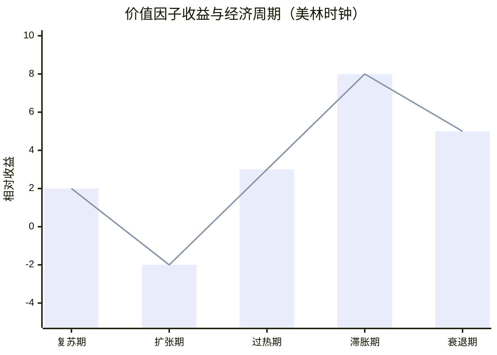
```mermaid
xychart-beta
    title "价值因子收益与经济周期（美林时钟）"
    x-axis ["复苏期", "扩张期", "过热期", "滞胀期", "衰退期"]
    y-axis "相对收益" -5 --> 10
    bar [2, -2, 3, 8, 5]
    line [2, -2, 3, 8, 5]
```

| 经济周期 | 价值因子表现 | 原因 |
|----------|-------------|------|
| **复苏期** | 中等 (+2%) | 成长与价值均有机会 |
| **扩张期** | 较弱 (-2%) | 成长股盈利弹性大 |
| **过热期** | 中等 (+3%) | 通胀上行利好周期价值股 |
| **滞胀期** | 强 (+8%) | 防御属性显现 |
| **衰退期** | 较强 (+5%) | 低估值提供安全边际 |

---

## Day 21-25: 动量因子

### Day 21: 动量效应的发现

#### 12-1动量策略示意图

```mermaid
gantt
    title 12-1动量策略时间线
    dateFormat X
    axisFormat %s

    section 形成期
    计算过去收益      :a1, 0, 9

    section 跳过期
    避免短期反转      :a2, 9, 10

    section 持有期
    持有一月          :a3, 10, 11
```

#### 动量收益结构

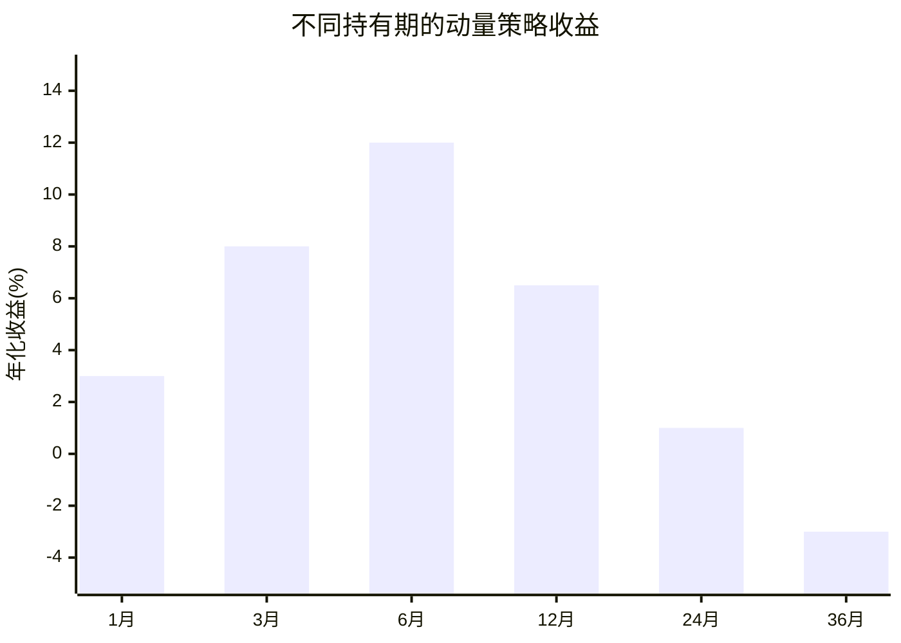
```mermaid
xychart-beta
    title "不同持有期的动量策略收益"
    x-axis ["1月", "3月", "6月", "12月", "24月", "36月"]
    y-axis "年化收益(%)" -5 --> 15
    bar [3, 8, 12, 6.5, 1, -3]
```

**最优区间**：3-12个月持有期收益最高，超过24个月出现反转。

---

### Day 24: 动量崩溃

#### 动量崩溃机制

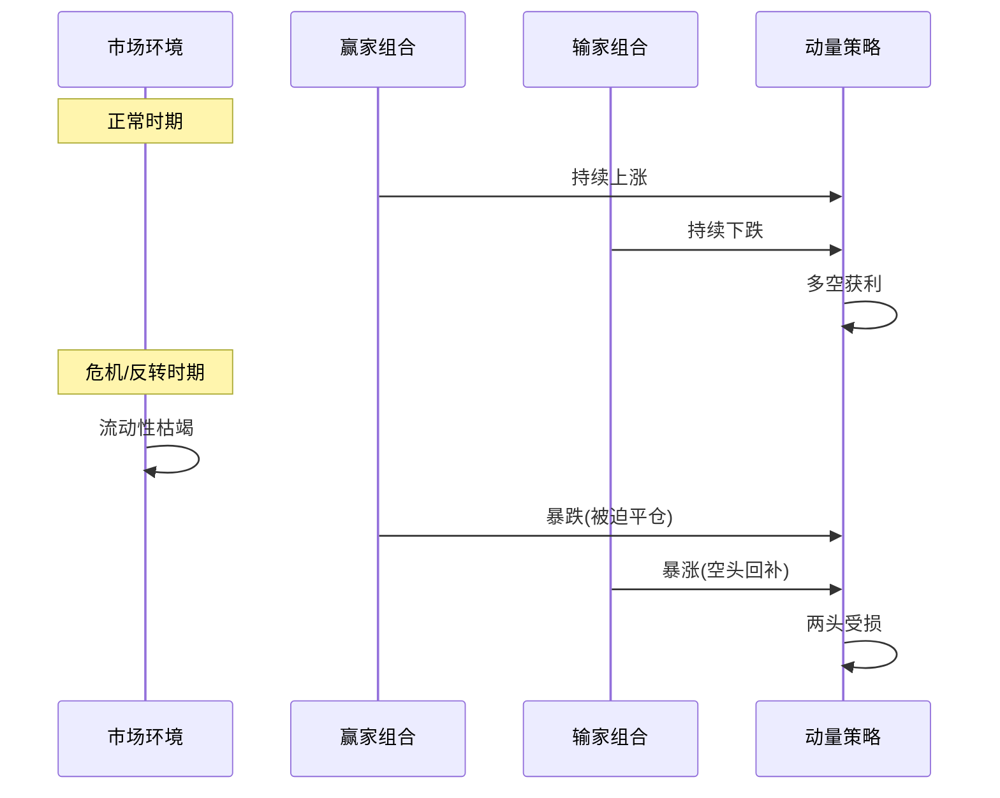
```mermaid
sequenceDiagram
    participant Market as 市场环境
    participant Winners as 赢家组合
    participant Losers as 输家组合
    participant Momentum as 动量策略

    Note over Market: 正常时期
    Winners->>Momentum: 持续上涨
    Losers->>Momentum: 持续下跌
    Momentum->>Momentum: 多空获利

    Note over Market: 危机/反转时期
    Market->>Market: 流动性枯竭
    Winners->>Momentum: 暴跌(被迫平仓)
    Losers->>Momentum: 暴涨(空头回补)
    Momentum->>Momentum: 两头受损
```

#### 历史上主要动量崩溃事件

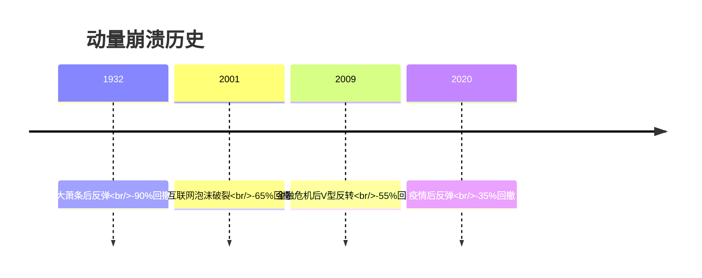
```mermaid
timeline
    title 动量崩溃历史
    1932 : 大萧条后反弹<br/>-90%回撤
    2001 : 互联网泡沫破裂<br/>-65%回撤
    2009 : 金融危机后V型反转<br/>-55%回撤
    2020 : 疫情后反弹<br/>-35%回撤
```

---

## Day 26-30: 质量因子

### Day 27-28: 质量因子的理论基础

#### 质量因子多维度

```mermaid
radar
    title 质量因子多维度评估
    axis 盈利能力
    axis 盈利稳定性
    axis 成长能力
    axis 财务安全
    axis 投资效率

    "高质量公司" : 0.9, 0.85, 0.8, 0.9, 0.75
    "低质量公司" : 0.3, 0.2, 0.4, 0.3, 0.25
    "市场平均" : 0.5, 0.5, 0.5, 0.5, 0.5
```

#### 质量 vs 价值的关系

```mermaid
quadrantChart
    title 质量-价值矩阵
    x-axis 低价值 --> 高价值
    y-axis 低质量 --> 高质量
    quadrant-1 高质量+高价值: 最佳选择
    quadrant-2 高质量+低价值: 质量溢价
    quadrant-3 低质量+低价值: 价值陷阱
    quadrant-4 低质量+高价值: 应避免

    "高质量价值股": [0.8, 0.85]
    "高质量成长股": [0.2, 0.9]
    "低质量价值股": [0.75, 0.2]
    "低质量成长股": [0.15, 0.15]
```

---

## Day 31-35: 低波动异象

### Day 31: 低波动异象的发现

#### 风险-收益悖论

```mermaid
xychart-beta
    title "理论 vs 实际：风险与收益关系"
    x-axis ["低波动", "中低波动", "中波动", "中高波动", "高波动"]
    y-axis "年化收益(%)" -2 --> 12
    bar "理论(CAPM)" [3, 5, 7, 9, 11]
    bar "实际(历史)" [8, 7, 6, 4, 2]
    line "理论预期" [3, 5, 7, 9, 11]
    line "实际观察" [8, 7, 6, 4, 2]
```

**悖论**：高波动股票实际收益反而更低！

#### 低波动策略的防御特性

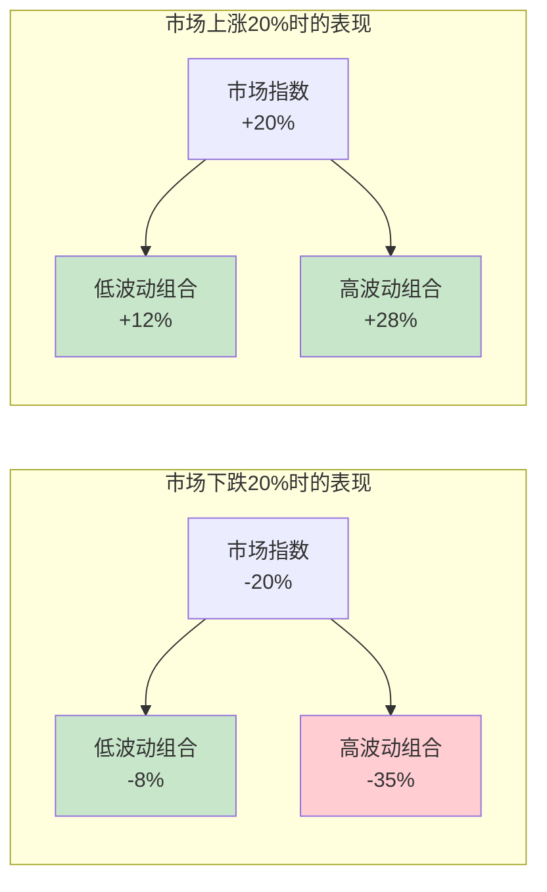
```mermaid
graph LR
    subgraph "市场下跌20%时的表现"
        A["市场指数<br/>-20%"] --> B["低波动组合<br/>-8%"]
        A --> C["高波动组合<br/>-35%"]
    end

    subgraph "市场上涨20%时的表现"
        D["市场指数<br/>+20%"] --> E["低波动组合<br/>+12%"]
        D --> F["高波动组合<br/>+28%"]
    end

    style B fill:#c8e6c9
    style C fill:#ffcdd2
    style E fill:#c8e6c9
    style F fill:#c8e6c9
```

---

## Day 36-40: 规模因子与小市值

### Day 36: 规模效应的发现

#### 规模因子历史表现

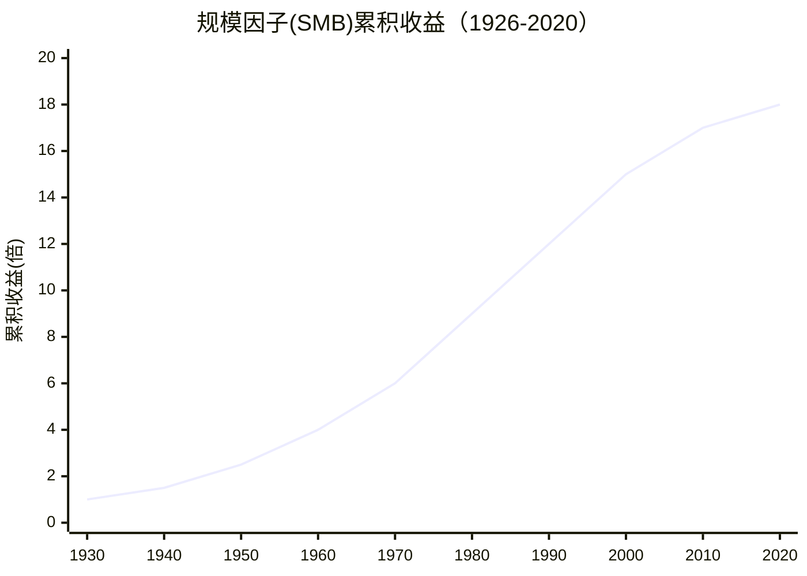
```mermaid
xychart-beta
    title "规模因子(SMB)累积收益（1926-2020）"
    x-axis ["1930", "1940", "1950", "1960", "1970", "1980", "1990", "2000", "2010", "2020"]
    y-axis "累积收益(倍)" 0 --> 20
    line "小盘 - 大盘" [1, 1.5, 2.5, 4, 6, 9, 12, 15, 17, 18]
```

**规模效应衰减**：1980年后规模效应减弱，2000年后几乎消失。

---

## 因子风险收益特征

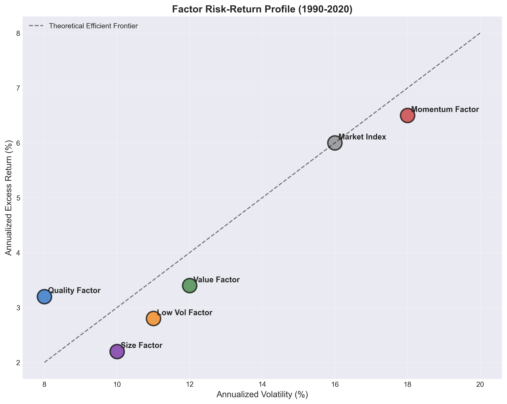

*因子年化收益与波动率关系（1990-2020）*

从图中可以观察到：
- **动量因子**：高收益但伴随高波动（18%波动率，6.5%超额收益）
- **质量因子**：低波动稳健收益（8%波动率，3.2%超额收益）
- **价值因子**：中等风险收益特征（12%波动率，3.4%超额收益）
- **低波动因子**：较低风险，适合防守配置

---

## 因子月度收益分布

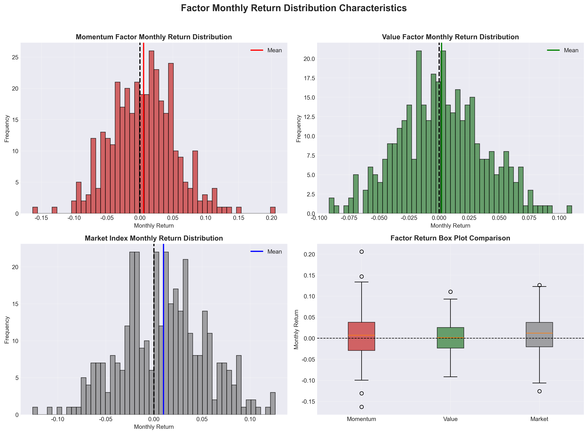

*因子月度收益率分布特征与箱线图对比*

**分布特征分析**：
- **动量因子**：右偏分布，极端收益较多，尾部风险大
- **价值因子**：更接近正态分布，收益相对稳定
- **市场指数**：基准参照，波动介于两者之间

---

## 因子回撤分析

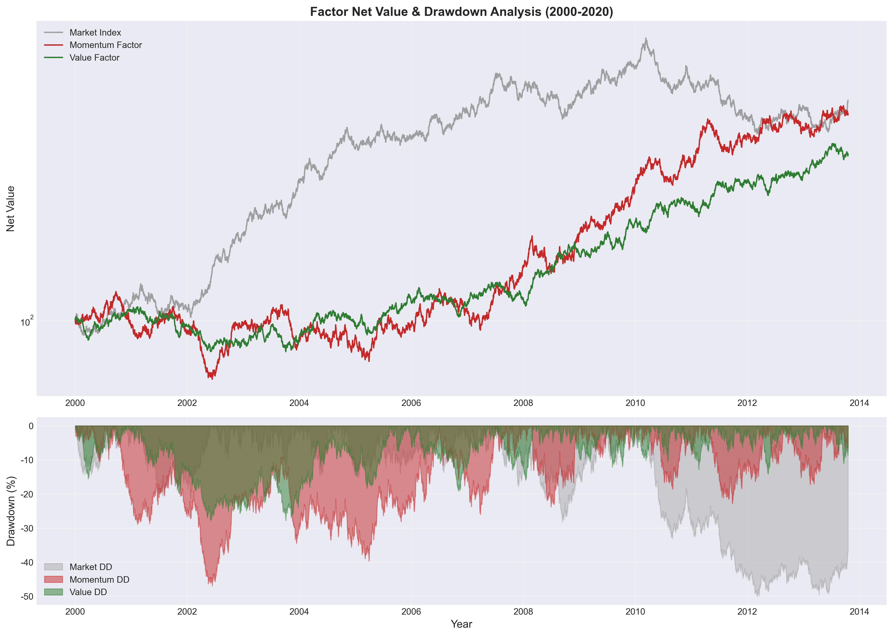

*因子净值曲线与回撤分析（2000-2020）*

**回撤特征**：
- **动量因子**：回撤幅度最大（可达40-50%），但恢复能力强
- **价值因子**：回撤相对温和，但可能持续较长时间
- **市场指数**：代表系统性风险水平

---

## Part 2 因子相关性分析

### 因子相关性矩阵

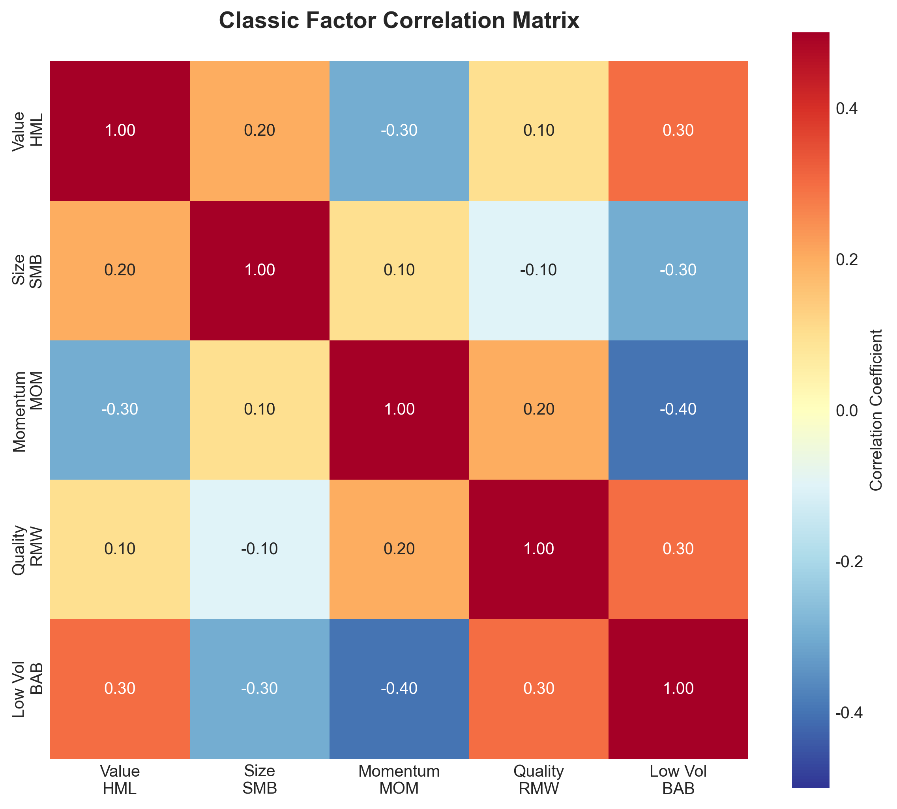

*因子收益相关性分析，基于1990-2020年历史数据*

| 因子对 | 相关性 | 组合效果 |
|--------|--------|----------|
| 价值-动量 | -0.3 | 分散效果佳 |
| 价值-质量 | +0.1 | 互补性一般 |
| 质量-低波动 | +0.3 | 双重防御 |
| 动量-低波动 | -0.4 | 攻守兼备 |
| 规模-低波动 | -0.3 | 风格分散 |

---

## Part 2 知识图谱

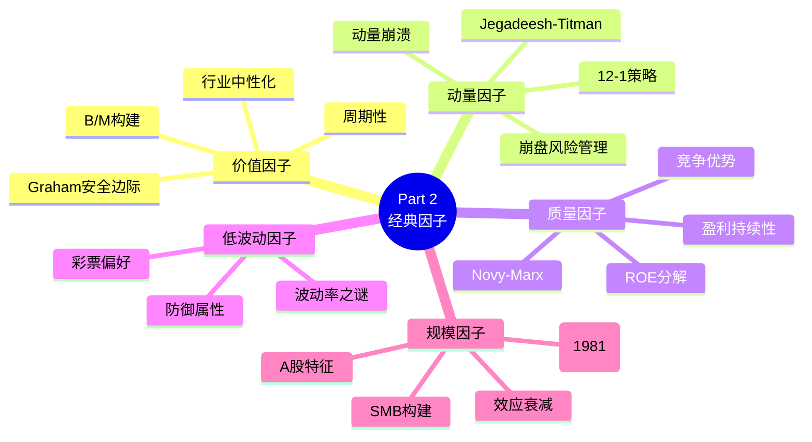
```mermaid
mindmap
  root((Part 2<br/>经典因子))
    价值因子
      Graham安全边际
      B/M构建
      行业中性化
      周期性
    动量因子
      12-1策略
      Jegadeesh-Titman
      动量崩溃
      崩盘风险管理
    质量因子
      ROE分解
      Novy-Marx
      盈利持续性
      竞争优势
    低波动因子
      波动率之谜
      彩票偏好
      防御属性
    规模因子
      Banz(1981)
      SMB构建
      效应衰减
      A股特征
```

---

## Part 2 总结

### 因子选择决策树

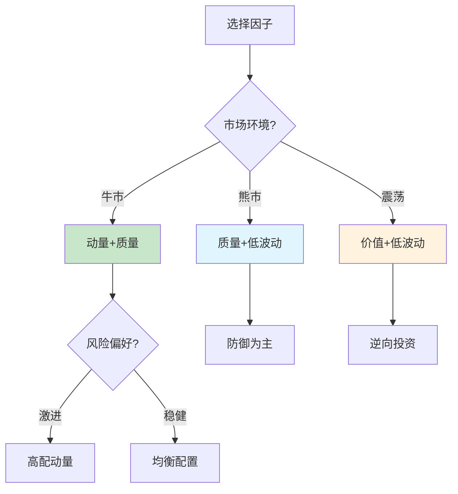
```mermaid
graph TD
    A["选择因子"] --> B{"市场环境?"}
    B -->|牛市| C["动量+质量"]
    B -->|熊市| D["质量+低波动"]
    B -->|震荡| E["价值+低波动"]

    C --> F{"风险偏好?"}
    F -->|激进| G["高配动量"]
    F -->|稳健| H["均衡配置"]

    D --> I["防御为主"]
    E --> J["逆向投资"]

    style C fill:#c8e6c9
    style D fill:#e1f5ff
    style E fill:#fff3e0
```

### 关键要点回顾

| 因子 | 核心逻辑 | 主要风险 | A股特点 |
|------|----------|----------|---------|
| **价值** | 均值回归 | 价值陷阱，长期跑输 | 周期性强 |
| **动量** | 趋势延续 | 动量崩溃 | 短期反转 |
| **质量** | 好公司长期创造价值 | 估值过高 | ROE有效 |
| **低波动** | 彩票偏好 | 牛市大幅跑输 | 防御效果好 |
| **规模** | 流动性风险 | 流动性枯竭 | 效应减弱 |

准备好进入Part 3，探索现代因子扩展了吗？
