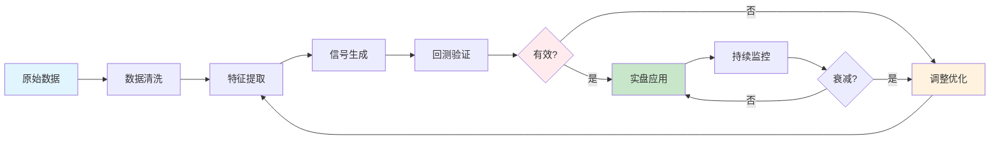
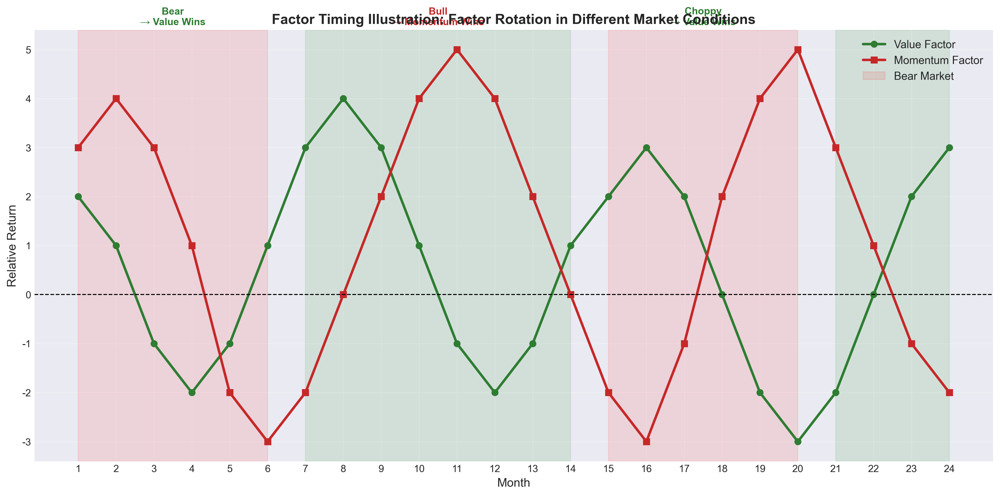

# Part 3: 现代因子扩展（Days 41-65）

> **学习目标**：了解数据和技术进步带来的新因子，掌握另类数据分析和机器学习方法。

---

## 📊 现代因子与传统因子对比

```mermaid
quadrantChart
    title 因子类型：信息优势 vs 实施难度
    x-axis 低信息优势 --> 高信息优势
    y-axis 低实施难度 --> 高实施难度
    quadrant-1 高信息+高难度: 专业护城河
    quadrant-2 高信息+低难度: 理想目标
    quadrant-3 低信息+低难度: 过度拥挤
    quadrant-4 低信息+高难度: 不值得

    "传统基本面": [0.3, 0.2]
    "传统价量": [0.4, 0.3]
    "卫星数据": [0.8, 0.7]
    "舆情/NLP": [0.7, 0.6]
    "供应链": [0.75, 0.5]
    "机器学习": [0.6, 0.8]
    "高频数据": [0.65, 0.85]
```

---

## Day 41-48: 另类数据因子

### Day 41: 另类数据革命

#### 什么是另类数据

**定义**：非传统金融数据，包括但不限于：
- 卫星图像（停车场、农田、建筑工地）
- 社交媒体和舆情数据
- 消费数据（信用卡、电商）
- 供应链和物流数据
- 企业行为数据（招聘、专利）

#### 另类数据处理流程



**与传统数据的区别**：

### Day 41: 另类数据革命

#### 什么是另类数据

**定义**：非传统金融数据，包括但不限于：
- 卫星图像（停车场、农田、建筑工地）
- 社交媒体和舆情数据
- 消费数据（信用卡、电商）
- 供应链和物流数据
- 企业行为数据（招聘、专利）

**与传统数据的区别**：
| 维度 | 传统数据 | 另类数据 |
|------|----------|----------|
| 频率 | 季度（财报） | 实时/日频 |
| 粒度 | 公司整体 | 细分业务/地区 |
| 时效 | 滞后 | 领先 |
| 结构 | 结构化 | 非结构化 |
| 获取难度 | 公开易得 | 需特殊渠道 |

#### 另类数据的发展历程

**第一阶段（2010年前）**：
- 以卫星图像为主
- 少数对冲基金使用
- 高昂的数据成本

**第二阶段（2010-2018）**：
- 社交媒体数据兴起
- 消费数据商业化
- 专业数据供应商出现

**第三阶段（2018至今）**：
- AI技术赋能数据处理
- 另类数据平台普及
- 进入主流投资流程

#### 另类数据的优势与挑战

**优势**：
1. **信息优势**：在传统信息公布前获得洞察
2. **频率优势**：高频更新，及时调整策略
3. **颗粒度优势**：更细维度的分析
4. **差异化**：尚未被广泛使用的alpha来源

**挑战**：
1. **数据质量**：噪声大、准确性难以验证
2. **技术门槛**：需要大数据和AI能力
3. **成本高昂**：购买和存储成本
4. **合规风险**：隐私和监管问题
5. **信号衰减**：一旦有效会被快速套利

#### 思考题

1. 另类数据是否会像传统数据一样最终失效？如果是，周期是多长？
2. 如何验证另类数据的真实性和准确性？
3. 在A股市场，哪些另类数据可能最具价值？（考虑数据可得性）

---

### Day 42-43: 卫星数据因子

#### 卫星数据的应用场景

**1. 零售业客流量分析**

- **方法**：监测商场、门店停车场车辆数
- **信号**：车辆数变化 → 客流量预测 → 销售额预测
- **案例**：监测沃尔玛停车场，提前预测季度财报
- **优势**：比财报早1-2个月获得信息

**2. 农业产量预测**

- **方法**：光谱分析农作物生长情况
- **信号**：植被指数 → 产量预测 → 农产品价格 → 相关股票
- **应用**：大豆、玉米、小麦等主粮作物
- **影响**：农业公司、食品加工、化肥农药

**3. 能源与资源监控**

- **方法**：监测油田、矿山、工厂活动
- **信号**：
  - 油轮存储量 → 原油库存
  - 矿山开采活动 → 矿产产量
  - 工厂烟囱排放 → 生产活动
- **应用**：能源股、资源股投资决策

**4. 建筑业与房地产**

- **方法**：建筑工地进度监测
- **信号**：施工进度 → 项目完工预测 → 收入确认
- **应用**：建筑公司、房地产开发商

#### 卫星数据因子的构建

**数据获取**：
- 商业卫星服务商（Orbital Insight, RS Metrics等）
- 公开卫星数据（NASA, ESA）
- 自建分析能力

**信号提取**：
```
1. 图像采集 → 2. 图像处理 → 3. 特征提取 → 4. 趋势分析 → 5. 投资信号
```

**常见信号**：
- 车辆数同比增长率
- 停车场占用率变化
- 工地活跃度指数
- 夜间灯光指数（经济活动代理）

#### 卫星数据的风险与局限

**1. 信号衰减**
- 使用卫星数据的机构增多
- 信号逐渐被price in
- 需要持续寻找新指标

**2. 天气和季节影响**
- 恶劣天气影响图像质量
- 季节性波动需要调整
- 异常天气导致误判

**3. 验证困难**
- 难以ground truth验证
- 与财报数据对应关系不明确
- 存在false positive

#### A股市场的应用

**适用场景**：
- 大型购物中心运营商
- 连锁餐饮（门店监测）
- 仓储物流园区
- 大型工厂（钢铁、水泥）

**挑战**：
- 覆盖密度不如美国
- 数据分析成本高
- 中小企业难以监测

#### 思考题

1. 卫星数据因子的alpha来源是什么？是信息优势还是分析能力？
2. 如何判断一个卫星数据信号是否已经被市场price in？
3. 除了停车场和农田，还有哪些卫星数据应用场景可能被低估？

---

### Day 44-45: 舆情与社交媒体因子

#### 舆情数据的类型

**1. 社交媒体数据**
- Twitter/X（海外）
- StockTwits（投资社区）
- Reddit（WallStreetBets等）
- 雪球、东方财富股吧（A股）

**2. 新闻与公告**
- 财经新闻情感分析
- 公司公告解读
- 分析师报告提取
- 监管信息披露

**3. 搜索与关注数据**
- 搜索指数（百度指数、Google Trends）
- APP下载量
- 网站访问量

#### 舆情因子的构建方法

**1. 情感分析（Sentiment Analysis）**

```
文本 → 分词 → 情感词典匹配/机器学习 → 情感得分 → 聚合指标
```

**情感指标**：
- 情感极性（正面/负面/中性）
- 情感强度
- 情感变化率
- 情感分歧度（多方观点差异）

**2. 关注度指标**

- 提及次数
- 讨论热度
- 搜索指数
- 媒体报道量

**3. 网络结构分析**

- 信息传播路径
- 意见领袖识别
- 信息扩散速度
- 羊群效应度量

#### 舆情因子的实证发现

**1. 情感与收益的关系**

- 正面情感 → 短期超额收益
- 但随后可能反转
- 极端情感（过度乐观/悲观）预示反转

**2. 关注度与收益的关系**

- 关注度突然增加 → 短期动量
- 高关注度股票通常估值偏高
- 长期低关注度可能有价值机会

**3. 社交媒体与散户行为**

- 散户聚集的社区情绪更极端
- 可以预测散户资金流向
- 反向指标价值（ contrarian signal）

#### 舆情数据的风险

**1. 操纵与噪音**
- 水军团控评
- 虚假信息传播
- 噪声远大于信号

**2. 法律合规风险**
- 隐私保护法规
- 内幕信息界定
- 跨市场合规

**3. 技术挑战**
- 语义理解困难
- 讽刺和反讽识别
- 跨语言分析

#### A股舆情因子的特点

**1. 散户主导的信息传播**
- 东方财富、雪球影响力大
- 情绪极端化明显
- 羊群效应强

**2. 政策敏感**
- 政策解读影响大
- 需要NLP理解政策文本
- 政策预期 vs 实际落地

**3. 题材炒作文化**
- 概念炒作频繁
- 舆情推动短期暴涨
- 需要识别"真热点"vs"伪热点"

#### 思考题

1. 舆情因子与动量因子有何关系？它们是独立的还是重复的？
2. 如何识别舆情数据中的操纵和噪音？需要哪些技术手段？
3. 在A股市场，如何利用舆情因子进行反向投资？需要注意哪些风险？

---

### Day 46-47: 供应链与消费数据因子

#### 供应链数据分析

**核心逻辑**：
- 一个公司的业绩与其客户、供应商相关
- 客户订单增加 → 供应商收入增加
- 可以提前预测相关公司业绩

#### 供应链因子信息传播链


**信息优势窗口期**：通常在财报公布前1-3个月获得信号

**数据类型**：
- 海关进出口数据
- 供应链披露（大客户、大供应商）
- 物流和货运数据
- 采购订单数据

**应用场景**：
- 苹果产业链（预测A股苹果供应商）
- 汽车产业链（车企销量 → 零部件企业）
- 能源产业链（油价 → 石化企业）

#### 消费数据因子

**1. 信用卡数据**

- 消费金额和频次
- 消费类别分布
- 消费趋势变化

**应用**：
- 零售企业销售额预测
- 消费趋势判断
- 宏观消费指标领先

**2. 电商数据**

- 平台销售数据
- 品牌销售排名
- 价格变化

**应用**：
- 消费品公司业绩预测
- 品牌竞争力分析
- 电商股业绩跟踪

**3. 支付数据**

- 移动支付交易数据
- 区域消费分析
- 行业消费对比

#### 消费数据因子的构建

**数据整合**：
```
信用卡数据 + 电商数据 + 搜索数据 → 综合消费指数 → 公司业绩预测
```

**信号类型**：
- 同比增长率
- 环比变化率
- 与预期的差异
- 消费结构变化

#### 供应链与消费数据的优势

**1. 领先性**
- 消费数据领先财报1-2个月
- 供应链数据可以提前数月

**2. 高频率**
- 周度甚至日度更新
- 可以及时调整预期

**3. 细分度**
- 可以分析具体产品线
- 地区差异分析

#### 风险与挑战

**1. 数据可得性**
- 隐私保护限制数据获取
- 数据供应商垄断
- 成本高昂

**2. 代表性问题**
- 样本是否代表整体
- 区域偏差
- 人群偏差

**3. 信号衰减**
- 使用这些数据的人多后
- 预测能力快速下降
- 需要持续创新

#### A股应用

**适用行业**：
- 消费电子（手机、电脑）
- 汽车及零部件
- 消费品（白酒、家电）
- 零售（百货、超市）

**特殊考虑**：
- 618、双11等购物节影响
- 春节等节假日效应
- 政策补贴影响（如汽车下乡）

#### 思考题

1. 供应链因子的信息传播链条有多长？如何确定最优的投资时机？
2. 消费数据因子在不同行业的有效性有何差异？为什么？
3. 如果越来越多的机构使用这类数据，这些因子的半衰期是多长？

---

### Day 48: 另类数据因子的评价框架

#### 另类数据的投资价值评估

**评估维度**：

**1. 信息含量（Information Content）**
- 与未来收益的相关性
- 预测能力（IC、IR）
- 增量信息（是否已被其他数据包含）

**2. 时效性（Timeliness）**
- 领先财报多久
- 更新频率
- 历史数据长度

**3. 可靠性（Reliability）**
- 数据质量
- 准确性验证
- 稳定性

**4. 可获取性（Accessibility）**
- 获取成本
- 法律合规性
- 技术门槛

**5. 可持续性（Sustainability）**
- 信号半衰期
- 竞争程度
- 数据供应稳定性

#### 另类数据的整合策略

**1. 多源验证**
- 不同数据源交叉验证
- 提高信号可靠性
- 识别异常值

**2. 分层使用**
- 核心因子：高置信度、大权重
- 辅助因子：提供补充信息
- 探索性因子：持续测试

**3. 动态调整**
- 监控因子有效性
- 失效时及时退出
- 新因子持续引入

#### 另类数据的未来趋势

**1. AI驱动的数据分析**
- 大语言模型处理文本数据
- 计算机视觉处理图像数据
- 多模态融合

**2. 数据民主化**
- 数据成本下降
- 分析工具普及
- 散户也能获取部分数据

**3. 监管趋严**
- 隐私保护法规
- 内幕信息界定
- 公平获取原则

#### 思考题

1. 如何构建一个系统化的另类数据评价框架？需要哪些量化指标？
2. 另类数据的竞争优势会持续多久？如何保持持续领先？
3. 在A股市场，另类数据的监管环境会如何发展？投资者应该如何应对？

---

## Day 49-55: 机器学习因子

### Day 49: 机器学习在量化中的应用概述

#### 为什么使用机器学习

**传统方法的局限**：
- 线性关系假设
- 手工特征工程
- 难以处理高维数据
- 非线性关系捕捉困难

**机器学习的优势**：
- 自动特征学习
- 非线性建模
- 处理高维数据
- 模式识别能力

#### 机器学习在量化中的主要应用

**1. 特征工程**
- 自动特征提取
- 特征组合和变换
- 降维处理

**2. 收益预测**
- 股票收益预测
- 因子收益预测
- 市场方向预测

**3. 分类问题**
- 赢家/输家分类
- 升/降评级预测
- 事件影响分类

**4. 组合优化**
- 风险模型构建
- 组合权重优化
- 交易成本建模

#### 常用机器学习方法对比

```mermaid
quadrantChart
    title 机器学习模型：可解释性 vs 预测能力
    x-axis 低可解释性 --> 高可解释性
    y-axis 低预测能力 --> 高预测能力
    quadrant-1 高预测+高可解释: 理想选择
    quadrant-2 高预测+低可解释: 黑盒问题
    quadrant-3 低预测+低可解释: 避免使用
    quadrant-4 低预测+高可解释: 基准模型

    "线性回归": [0.8, 0.3]
    "Lasso/Ridge": [0.75, 0.4]
    "随机森林": [0.5, 0.7]
    "XGBoost": [0.4, 0.8]
    "神经网络": [0.1, 0.85]
    "Transformer": [0.15, 0.9]
    "SVM": [0.3, 0.6]
```

**监督学习方法**：
- **线性模型**（Ridge/Lasso）：可解释性强，适合特征选择
- **树模型**（XGBoost/LightGBM）：非线性建模，实战表现优异
- **神经网络**（MLP/LSTM/Transformer）：高维数据处理，模式识别能力强

**无监督学习**：
- 聚类分析（K-means, DBSCAN）
- 主成分分析（PCA）
- 异常检测

**强化学习**：
- 组合动态调整
- 交易执行优化
- 策略自适应

#### 机器学习在量化中的挑战

**1. 过拟合风险**
- 金融数据信噪比低
- 样本外表现往往差于样本内
- 需要严格的正则化和验证

**2. 数据问题**
- 非平稳性（regime变化）
- 前瞻性偏差
- 幸存者偏差

**3. 可解释性**
- 黑盒模型难以解释
- 投资者需要理解投资逻辑
- 监管要求可解释性

**4. 实施成本**
- 计算资源需求
- 人才要求
- 模型维护

#### 思考题

1. 机器学习在量化投资中是"圣杯"还是"陷阱"？关键区别是什么？
2. 传统线性模型和机器学习模型各自的适用场景是什么？
3. 如何在机器学习模型中避免过拟合？有哪些具体的技术手段？

---

### Day 50-51: 监督学习因子

#### 回归方法

**1. 正则化线性模型**

**Lasso回归**：
```python
# L1正则化，自动特征选择
min ||y - Xβ||² + λ||β||₁
```
- 产生稀疏解，自动选择重要因子
- 适合高维因子场景

**Ridge回归**：
```python
# L2正则化，处理多重共线性
min ||y - Xβ||² + λ||β||₂²
```
- 处理因子间多重共线性
- 所有因子都保留，但权重收缩

**Elastic Net**：
- L1和L2的组合
- 兼顾特征选择和稳定性

**2. 树模型**

**随机森林**：
- 多棵决策树集成
- 处理非线性关系
- 提供特征重要性

**梯度提升树（XGBoost/LightGBM）**：
- 串行训练，逐步修正错误
- 在金融预测中表现优异
- 速度快，可处理大规模数据

**3. 神经网络**

**多层感知机（MLP）**：
- 全连接神经网络
- 捕捉复杂非线性关系
- 需要大量数据和调参

**应用实例**：
- 用100+个因子预测股票收益
- 网络结构：输入层(100) → 隐藏层(64) → 隐藏层(32) → 输出层(1)
- 使用ReLU激活和Dropout正则化

#### 分类方法

**1. 二分类：赢家 vs 输家**

**问题设定**：
- 输入：因子暴露
- 输出：下期是否跑赢中位数（1/0）

**常用模型**：
- 逻辑回归
- 支持向量机（SVM）
- 随机森林分类
- 神经网络分类

**2. 多分类：评级预测**

- 将股票分为5-10个等级
- 使用有序回归或分类
- 构建分层组合

#### 模型评估

**避免过拟合的关键**：

**1. 时间序列交叉验证**
- 不能用随机分割（违反时间顺序）
- 使用滚动窗口训练/验证
- purged k-fold交叉验证

**2. 正则化**
- L1/L2正则化
- Dropout（神经网络）
- 早停（Early Stopping）

**3. 样本外测试**
- 严格的样本外验证
- 模拟实盘环境
- 考虑交易成本

#### 思考题

1. 为什么在金融预测中使用时间序列交叉验证，而不是随机交叉验证？
2. Lasso回归的稀疏性在金融因子选择中有何优势？如何确定最优的λ参数？
3. 树模型和神经网络在金融预测中各有什么优劣？在什么情况下选择哪种？

---

### Day 52-53: 非监督学习与特征工程

#### 聚类分析

**应用场景**：
- 股票分组（超越行业分类）
- 因子分组（识别相关因子）
- 市场状态识别

**常用方法**：

**K-means聚类**：
```python
# 基于因子暴露将股票分为K组
- 每组内股票特征相似
- 组间特征差异大
- 可用于构建差异化组合
```

**层次聚类**：
- 构建股票相似度树
- 识别因子暴露的层级结构
- 更灵活的组别划分

**DBSCAN**：
- 基于密度的聚类
- 自动识别异常值
- 适合识别"离群"股票

#### 降维技术

**主成分分析（PCA）**：

```
原始因子：f1, f2, ..., fn
PCA转换：pc1, pc2, ..., pck (k < n)
pc1解释最多方差，pc2次之，以此类推
```

**应用**：
- 消除因子多重共线性
- 提取核心驱动因素
- 可视化高维数据

**局限性**：
- PC不具可解释性
- 可能丢失重要信息
- 线性假设

**t-SNE/UMAP**：
- 非线性降维
- 适合可视化
- 保留局部结构

#### 自动特征工程

**1. 特征组合**

传统方法手工定义：
```
价值 + 质量 = 价值质量复合因子
```

机器学习方法自动发现：
```
通过遗传算法或神经网络自动搜索最优特征组合
```

**2. 特征变换**

- 非线性变换：log, sqrt, 幂次
- 时序特征：移动平均、动量、波动率
- 交互特征：因子间乘积、比率

**3. 深度学习特征学习**

**自动编码器（Autoencoder）**：
```
输入层 → 编码器 → 潜在空间 → 解码器 → 输出层
学习低维度的有效特征表示
```

**应用**：
- 从原始数据自动提取特征
- 降维和去噪
- 异常检测

#### 特征重要性分析

**树模型的特征重要性**：
- Gini重要性：基于节点分裂的纯度提升
- 置换重要性：随机打乱特征值看性能下降

**线性模型的系数**：
- 标准化后的系数大小
- 正则化后的非零系数

**SHAP值**：
- 基于博弈论的特征归因
- 解释单个预测
- 全局重要性汇总

#### 思考题

1. PCA在金融因子分析中的应用价值是什么？如何权衡信息损失和共线性消除？
2. 自动特征工程发现的特征组合是否有经济逻辑？如何验证其稳健性？
3. SHAP值如何提高机器学习模型的可解释性？在量化投资中可解释性有多重要？

---

### Day 54-55: 深度学习和强化学习

#### 深度学习在量化中的应用

**1. 卷积神经网络（CNN）**

**应用场景**：
- 处理图表模式（K线形态）
- 图像数据分析（卫星图、新闻图）
- 局部特征提取

**结构**：
```
输入(价格图表) → 卷积层 → 池化层 → 全连接层 → 输出(预测)
```

**2. 循环神经网络（RNN/LSTM/GRU）**

**应用场景**：
- 时序数据建模
- 价格序列预测
- 文本序列分析

**LSTM优势**：
- 长短期记忆能力
- 解决梯度消失问题
- 适合长序列建模

**3. Transformer**

**应用场景**：
- 多变量时序预测
- 文本情感分析
- 跨资产关系建模

**优势**：
- 自注意力机制
- 并行计算能力
- 捕捉长距离依赖

**金融Transformer应用**：
- 用Transformer处理多因子时序
- 替代RNN进行时序建模
- 多资产联合建模

#### 强化学习在量化中的应用

**问题设定**：

**状态（State）**：
- 市场状态（价格、成交量、波动率）
- 组合状态（持仓、权重、收益）
- 因子状态（因子值、暴露）

**动作（Action）**：
- 调仓决策（买/卖/持有）
- 权重调整
- 风险敞口调整

**奖励（Reward）**：
- 投资收益（考虑风险调整）
- 交易成本惩罚
- 约束违反惩罚

**常用算法**：

**1. Q-Learning / Deep Q-Network (DQN)**
- 学习状态-动作值函数
- 适合离散动作空间
- 处理高维状态空间

**2. 策略梯度（Policy Gradient）**
- 直接优化策略
- 适合连续动作空间
- 可以学习随机策略

**3. Actor-Critic**
- 结合值函数和策略梯度
- A2C, A3C, PPO等变体
- 稳定性和效率的平衡

#### 深度学习的挑战

**1. 数据需求**
- 深度学习需要大量数据
- 金融数据有限且有噪声
- 需要数据增强技术

**2. 训练难度**
- 超参数调优复杂
- 训练不稳定
- 局部最优问题

**3. 可解释性**
- 神经网络是黑盒
- 难以解释投资决策
- 监管和风控挑战

**4. 过拟合**
- 高容量模型容易过拟合
- 需要强正则化
- 严格的样本外验证

#### 思考题

1. 深度学习在图像识别中非常成功，为什么在量化投资中应用有挑战？关键区别是什么？
2. 强化学习在量化中的优势是什么？目前最大的障碍是什么？
3. 机器学习因子与传统因子的关系是什么？是替代、补充还是提升？

---

## Day 56-60: 宏观因子与周期模型

### Day 56-57: 宏观经济因子

#### 宏观因子体系

**什么是宏观因子**

宏观因子是反映整体经济状况的变量，影响所有资产的系统性风险因素：

**主要宏观因子**：
1. **经济增长**：GDP增长、工业增加值
2. **通胀**：CPI、PPI
3. **利率**：政策利率、市场利率
4. **信用**：信用利差、违约率
5. **汇率**：本币汇率、美元强弱
6. **流动性**：货币供应量、信贷增长

#### 宏观因子的资产定价影响

**资产收益与宏观因子的关系**：

| 宏观环境 | 股票 | 债券 | 商品 | 汇率 |
|----------|------|------|------|------|
| 经济增长↑ | + | - | + | 本币↑ |
| 通胀↑ | - | -- | ++ | 本币↓ |
| 利率↑ | - | -- | + | 本币↑ |
| 信用扩张 | + | + | + | 本币↑ |

**因子暴露随宏观环境变化**：
- 价值因子：通胀上行期表现好
- 动量因子：趋势市场（单边）表现好
- 低波动：熊市/震荡市表现好

#### 宏观因子的预测方法

**1. 领先指标法**

**常用领先指标**：
- PMI（制造业采购经理指数）
- 新订单指数
- 消费者信心指数
- 货币供应增速

**2. 期限结构法**

**利率期限结构**：
- 收益率曲线形状
- 期限利差（10Y-2Y）
- 预测经济衰退/扩张

**3. 信用利差法**

**信用利差**：
- 高收益债-国债利差
- 信用利差扩大 → 经济下行风险
- 信用利差收窄 → 经济改善

#### 宏观因子与风格配置

**因子择时（Factor Timing）**：

根据宏观环境动态调整因子暴露：

```python
经济扩张期：增配价值、动量
经济衰退期：增配质量、低波动
通胀上行期：增配价值、商品
利率上行期：减配成长、增配价值
```

**实施挑战**：
- 宏观数据发布滞后
- 宏观预测准确性有限
- 因子-宏观关系不稳定



*因子轮动示意图：不同市场环境下的因子表现差异*

**图示解读**：
- **熊市（红色区域）**：价值因子通常表现优于动量因子
- **牛市（绿色区域）**：动量因子通常领跑，价值因子相对落后
- **震荡市**：价值因子往往展现出防御性优势

这种周期性轮动为因子择时提供了理论基础。

#### 思考题

1. 宏观因子与传统基本面因子的关系是什么？如何整合两类因子？
2. 宏观因子择时的可靠性如何？如何提高宏观预测的准确性？
3. 在A股市场，哪些宏观指标对因子表现影响最大？为什么？

---

### Day 58-59: 经济周期模型

#### 经济周期的四个阶段

**经典美林时钟**：

| 阶段 | 增长 | 通胀 | 优势资产 | 优势因子 |
|------|------|------|----------|----------|
| 复苏 | ↑ | ↓ | 股票 | 价值、动量 |
| 过热 | ↑ | ↑ | 商品 | 价值、小盘 |
| 滞胀 | ↓ | ↑ | 现金 | 质量、低波动 |
| 衰退 | ↓ | ↓ | 债券 | 质量、低波动 |

**周期长度**：
- 完整周期：5-8年
- 但难以精确预测转折点
- 需要多指标综合判断

#### 状态转换模型

**Regime-Switching模型**：

**Hamilton模型**：
```
市场处于不同状态（Regime），每个状态有不同的收益分布
状态转换服从马尔可夫过程
```

**应用**：
- 识别当前市场状态
- 预测状态转换概率
- 动态调整策略

**实现步骤**：
1. 定义状态（牛市/熊市/震荡）
2. 估计各状态的收益分布
3. 估计状态转换概率
4. 预测未来状态和收益

#### 周期与因子表现

**各周期阶段的因子表现**：

**复苏期**：
- 价值因子：表现良好（利率上行）
- 动量因子：表现良好（趋势形成）
- 质量因子：中性
- 低波动：跑输

**过热期**：
- 价值因子：表现良好
- 小盘因子：表现良好（风险偏好高）
- 动量因子：表现良好
- 低波动：跑输

**滞胀期**：
- 价值因子：表现良好
- 质量因子：表现良好（防御）
- 低波动：表现良好
- 动量因子：可能反转

**衰退期**：
- 质量因子：表现最佳（防御）
- 低波动：表现良好
- 价值因子：可能承压（盈利下滑）
- 动量因子：可能崩溃

#### 思考题

1. 美林时钟在A股市场的适用性如何？有哪些需要调整的地方？
2. 如何判断当前处于经济周期的哪个阶段？需要哪些指标？
3. 因子择时的价值有多大？因子择时 vs 因子组合，哪种更有效？

---

### Day 60: 宏观因子与A股市场

#### A股宏观因子的特殊性

**1. 政策影响大**
- 货币政策传导机制不同
- 财政政策直接干预
- 产业政策影响行业轮动

**2. 外部因素**
- 中美利差影响资本流动
- 汇率与股市关系复杂
- 全球风险情绪传导

**3. 结构转型**
- 从投资驱动到消费驱动
- 从制造业到服务业
- 宏观因子影响在变化

#### A股因子与宏观的关系

**价值因子**：
- 与PPI正相关（周期股占比高）
- 利率上行期表现好
- 房地产周期影响大

**小盘因子**：
- 流动性宽松期表现好
- 与信用扩张相关
- 2017年后关系减弱

**动量因子**：
- 趋势市场（单边上涨/下跌）有效
- 震荡市效果差
- 与波动率负相关

**质量因子**：
- 防御属性，熊市表现好
- 与经济增长负相关
- 长期稳健

#### 宏观因子策略的构建

**步骤1：宏观指标选择**
- 领先指标（PMI、M1增速）
- 同步指标（GDP、工业增加值）
- 滞后指标（CPI、企业盈利）

**步骤2：状态识别**
- 基于多指标综合判断周期阶段
- 或使用Regime-Switching模型
- 设定状态转换规则

**步骤3：因子配置**
- 每个状态下的最优因子组合
- 考虑交易成本后的再平衡频率
- 设置状态误判的容错机制

**步骤4：风险控制**
- 宏观预测错误的缓冲
- 组合层面的风险预算
- 止损和再平衡机制

#### 思考题

1. 在A股市场，宏观因子择时的难度在哪里？如何克服？
2. 如果无法准确预测宏观状态，如何利用宏观信息改进因子策略？
3. 量化策略如何与宏观基本面分析结合？各自的优劣势是什么？

---

## Day 61-65: 情绪与行为因子

### Day 61-62: 投资者情绪因子

#### 情绪因子的理论基础

**核心观点**：
- 投资者情绪影响资产定价
- 情绪高涨 → 资产价格高估
- 情绪低落 → 资产价格低估
- 情绪可预测 → 反向投资机会

**情绪与收益的关系**：
- 高情绪 → 短期继续上涨（动量）
- 极端高情绪 → 随后反转
- 低情绪 → 价值机会

#### 情绪指标的类型

**1. 市场层面情绪指标**

**VIX（波动率指数）**：
- "恐慌指数"
- VIX高 = 恐慌 = 买入机会
- VIX低 = 贪婪 = 谨慎

**Put/Call比率**：
- 看跌期权/看涨期权成交量比
- 比率高 = 过度悲观
- 比率低 = 过度乐观

**牛熊比率**：
- 看涨情绪 / 看跌情绪
- 投资者情绪调查
- 情绪极端时反向操作

**2. 资金流向指标**

**基金资金流向**：
- 股票型基金净申购
- ETF资金流向
- 北向资金流向（A股）

**融资余额变化**：
- 两融余额增减
- 融资买入占比
- 散户情绪代理

**3. 衍生品市场指标**

**股指期货升贴水**：
- 升水（期货>现货）= 乐观
- 贴水（期货<现货）= 悲观
- A50期指、沪深300期指

**期权隐含波动率**：
- 隐含波动率 vs 实际波动率
- 波动率微笑形状
- 风险厌恶程度

#### 情绪因子的构建

**综合情绪指数**：
```
情绪指数 = w1 × VIX + w2 × Put/Call + w3 × 资金流向 + ...
```

**使用方法**：
- 情绪指数极端高 → 减仓/反向
- 情绪指数极端低 → 加仓
- 情绪指数中性 → 跟随趋势

**A股情绪指标**：
- 新增投资者数量
- 融资买入额占比
- 涨停家数/跌停家数比
- 换手率
- 北向资金流向

#### 思考题

1. 情绪因子与价值因子的关系是什么？情绪低迷期是否是价值投资的良机？
2. 如何区分"恐慌性下跌"（买入机会）和"基本面恶化"（应该离场）？
3. A股投资者情绪与美股有何不同？如何构建适合A股的情绪指标体系？

---

### Day 63-64: 分析师预期因子

#### 分析师数据的价值

**分析师预测的内容**：
- 盈利预测（EPS）
- 收入预测
- 目标价
- 投资评级（买入/持有/卖出）

**分析师数据的两个维度**：
1. **预期水平**：一致预期的绝对值
2. **预期变化**：预期的修正方向和幅度

#### 分析师预期因子

**1. 盈利惊喜（Earnings Surprise）**

**定义**：
```
SUE = (实际盈利 - 预期盈利) / 预期盈利标准差
```

**实证发现**：
- 正SUE → 公告后股价继续上涨（PEAD）
- 市场对盈利惊喜反应不足
- 效应持续数周至数月

**2. 预期修正（Estimate Revision）**

**定义**：
- 分析师上调/下调盈利预测
- 修正的一致性和幅度

**信号强度**：
- 上调幅度大 → 买入信号
- 下调幅度大 → 卖出信号
- 一致上调/下调 > 个别分析师

**3. 评级调整（Rating Change）**

**定义**：
- 投资评级的上调/下调
- 目标价调整

**有效性**：
- 评级上调短期有效
- 但可能存在利益冲突
- 需要结合其他因子

#### 分析师数据的局限

**1. 乐观偏差**
- 分析师普遍乐观
- 评级集中在买入
- 下调滞后于基本面

**2. 利益冲突**
- 投行业务关系
- 不愿得罪上市公司
- 独立性不足

**3. 覆盖偏差**
- 大市值、热门股票覆盖多
- 小市值、冷门股票覆盖少
- 信息不对称

#### A股分析师因子的特点

**1. 覆盖率低**
- 相比美股，A股分析师覆盖率低
- 中小公司无覆盖
- 信息含量更高

**2. 准确性问题**
- 预测误差较大
- 行业差异明显
- 需要质量筛选

**3. 与政策相关**
- 行业政策影响分析师判断
- 政策预期纳入盈利预测
- 政策变化导致预测调整

#### 思考题

1. 为什么市场对盈利惊喜会反应不足？行为金融学如何解释PEAD效应？
2. 如何评估分析师预测的质量？哪些特征表明分析师更可靠？
3. 在A股市场，分析师预期因子是否比美股更有效？为什么？

---

### Day 65: Part 3 总结

#### 现代因子扩展的核心要点

**1. 另类数据带来了新的Alpha来源**
- 卫星、舆情、供应链数据
- 信息优势窗口期在缩短
- 技术能力是核心竞争力

**2. 机器学习是工具，不是万能药**
- 可以提升传统因子效果
- 但过拟合风险高
- 可解释性与性能需要平衡

**3. 宏观因子提供配置框架**
- 理解因子表现的周期性
- 因子择时 vs 因子组合
- 宏观与微观的结合

**4. 情绪因子捕捉行为偏差**
- 情绪极端时反向操作
- 但区分情绪与基本面困难
- 情绪因子适合作为辅助

#### 现代因子的挑战

**1. 信号衰减加速**
- 信息传播更快
- 竞争更激烈
- 需要持续创新

**2. 技术门槛提高**
- 数据处理能力
- AI/ML技术
- 计算资源

**3. 监管环境变化**
- 数据隐私保护
- 公平获取原则
- 可解释性要求

#### 进入Part 4的准备

在Part 4中，我们将学习：
- 因子正交化与多重共线性处理
- 动态因子择时方法
- 风险模型原理（Barra）
- 收益归因体系

这些是多因子投资的高级主题，是将单因子组合成稳健策略的关键。

#### 思考题

1. 传统因子与现代因子如何整合？如何避免简单堆砌？
2. 在数据和技术能力有限的情况下，如何最大化因子研究的效果？
3. 未来5年，哪些因子类型可能最具价值？如何提前布局？
