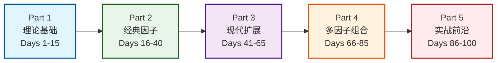
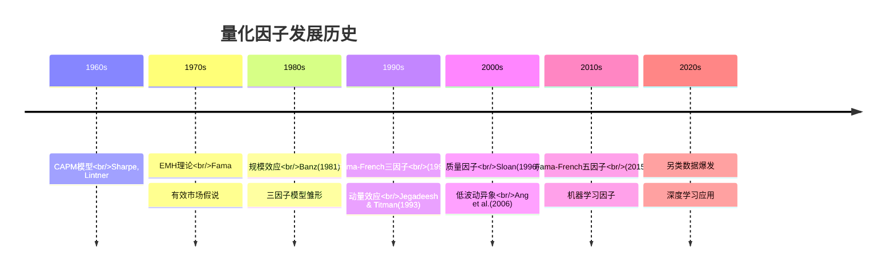
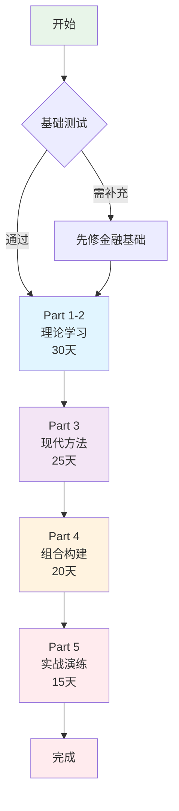

# 量化因子投资：从入门到精通（100天系统学习）

> **目标读者**：有编程基础和A股投资经验，希望系统理解量化因子原理的投资者
> **核心理念**：从因子流派的历史演进出发，深度理解每个因子存在的逻辑和适用边界
> **学习路径**：理论奠基 → 经典流派 → 现代扩展 → 多因子整合 → 实战应用

---

## 📊 学习路径总览



---

## 手册结构

### Part 1: 传统量化基础（Days 1-15）
理解量化投资的理论根基，建立正确的认知框架。

| 天数 | 主题 | 核心内容 |
|------|------|----------|
| Day 1-3 | 有效市场假说与行为金融学 | EMH的三个层次、市场异象、认知偏差 |
| Day 4-6 | 风险与收益的关系 | CAPM模型、系统性风险、Beta的本质 |
| Day 7-10 | 套利定价理论 | APT模型、多因子定价的思想起源 |
| Day 11-15 | Fama-French框架 | 三因子模型的革命性意义、五因子扩展 |

### Part 2: 经典因子流派（Days 16-40）
深入理解经受时间考验的经典因子。

| 天数 | 主题 | 核心内容 |
|------|------|----------|
| Day 16-20 | 价值因子 | P/E、P/B、P/FCF，Graham的价值投资量化 |
| Day 21-25 | 动量因子 | 价格动量、盈利动量、动量崩溃 |
| Day 26-30 | 质量因子 | ROE的分解、盈利稳定性、 accruals |
| Day 31-35 | 低波动异象 | 波动率之谜、Beta异象、防御性因子 |
| Day 36-40 | 规模因子与小市值 | SMB因子的历史表现、A股的小市值效应 |

### Part 3: 现代因子扩展（Days 41-65）
探索数据和技术进步带来的新因子。

| 天数 | 主题 | 核心内容 |
|------|------|----------|
| Day 41-48 | 另类数据因子 | 卫星数据、供应链分析、消费数据 |
| Day 49-55 | 机器学习因子 | 非线性关系、特征工程、模型可解释性 |
| Day 56-60 | 宏观因子与周期 | 经济周期模型、 regime switching |
| Day 61-65 | 情绪与行为因子 | 分析师预期、投资者情绪指标 |

### Part 4: 多因子与组合（Days 66-85）
学习如何将单因子整合成稳健的投资体系。

| 天数 | 主题 | 核心内容 |
|------|------|----------|
| Day 66-70 | 因子正交化 | 多重共线性问题、正交化方法 |
| Day 71-75 | 动态因子择时 | 因子轮动、宏观择时、状态依赖 |
| Day 76-80 | 风险模型原理 | Barra模型、因子风险暴露、主动风险 |
| Day 81-85 | 收益归因体系 | 绩效归因、Brinson模型、因子贡献 |

### Part 5: 实战与前沿（Days 86-100）
结合A股市场特点，探讨量化投资的未来。

| 天数 | 主题 | 核心内容 |
|------|------|----------|
| Day 86-90 | A股特殊因子 | 政策因子、散户行为、市值分层 |
| Day 91-95 | 因子拥挤与衰减 | 因子失效机制、拥挤度度量、半衰期 |
| Day 96-100 | 量化投资新趋势 | 深度学习、强化学习、另类投资 |

---

## 📈 五大因子收益特征对比

```mermaid
xychart-beta
    title "经典因子长期年化超额收益（1926-2020）"
    x-axis ["价值", "规模", "动量", "质量", "低波动"]
    y-axis "年化超额收益(%)" 0 --> 5
    bar [3.4, 2.2, 6.5, 3.2, 2.8]

    annotation 0, 3.4 "HML"
    annotation 1, 2.2 "SMB"
    annotation 2, 6.5 "MOM"
    annotation 3, 3.2 "RMW"
    annotation 4, 2.8 "BAB"
```

| 因子 | 年化超额 | 波动率 | 夏普比率 | 最大回撤 |
|------|----------|--------|----------|----------|
| **价值 (HML)** | 3.4% | 12% | 0.28 | -35% |
| **规模 (SMB)** | 2.2% | 10% | 0.22 | -25% |
| **动量 (MOM)** | 6.5% | 18% | 0.36 | -55% |
| **质量 (RMW)** | 3.2% | 8% | 0.40 | -15% |
| **低波动 (BAB)** | 2.8% | 11% | 0.25 | -20% |

> 💡 **洞察**：动量因子收益最高但波动最大；质量因子夏普比率最优；价值因子回撤期最长。

---

## 🔄 因子演进时间线



---

## 🎯 如何使用本手册

### 学习阶段规划



### 每日学习流程

```
┌─────────────────────────────────────┐
│  1. 阅读当日内容 (30-45分钟)         │
├─────────────────────────────────────┤
│  2. 理解核心概念和图表 (15-20分钟)   │
├─────────────────────────────────────┤
│  3. 运行代码示例实践 (20-30分钟)     │
├─────────────────────────────────────┤
│  4. 完成思考题 (10-15分钟)           │
├─────────────────────────────────────┤
│  5. 记录学习笔记 (10分钟)            │
└─────────────────────────────────────┘
                ↓
         [标记完成 ✓]
```

---

## 📚 推荐延伸阅读

### 学术期刊
- *Journal of Finance* - 金融顶级期刊
- *Journal of Financial Economics* - 理论与实证并重
- *Review of Financial Studies* - 高质量金融研究
- *Journal of Portfolio Management* - 实务导向

### 行业报告与机构
- **AQR** (Cliff Asness) - 因子投资先驱
- **Two Sigma** - 量化对冲基金研究
- **WorldQuant** - 因子挖掘方法论
- **Research Affiliates** - 资产配置研究

### 经典书籍
| 书名 | 作者 | 难度 | 核心内容 |
|------|------|------|----------|
| 《主动投资组合管理》 | Grinold & Kahn | ⭐⭐⭐⭐⭐ | 量化投资圣经 |
| 《量化投资策略》 | Edward Qian | ⭐⭐⭐⭐ | 因子策略系统介绍 |
| 《因子投资》 | Andrew Ang | ⭐⭐⭐ | 因子理论与实践 |
| 《量化交易》 | Ernest Chan | ⭐⭐⭐ | 实操指南 |
| 《证券分析》 | Graham & Dodd | ⭐⭐⭐⭐ | 价值投资源头 |

---

## ⚠️ 免责声明

*本手册为学习笔记性质，仅供教育交流使用。*

**量化投资风险提示**：
- 历史表现不代表未来收益
- 因子有效性可能随时间衰减
- 任何投资策略都有风险
- 不构成具体的投资建议

---

## 🤝 参与贡献

欢迎通过以下方式参与：
- 提交 Issue 报告错误
- 提交 PR 完善内容
- 分享学习心得
- 提出改进建议

**License**: MIT License
